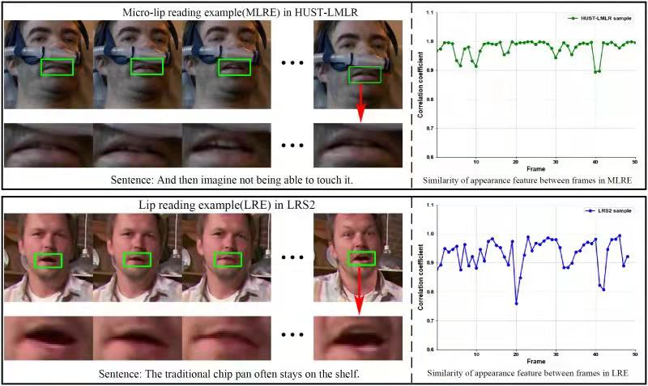

# Brief introduction towards micro lip reading in the wild

Lip reading is defined as the ability to recognize whatis being said from visual information alone [1]. In spite ofan impressive skill but very challenging task, lip reading hasbeen widely applied to such situations: improving obviousperformances where the acoustic signal is noisy, resolvingspeech perception problems for persons with hearing impair-ment, generating lip-passwords for liveness detection for itshigh dynamic characteristics, etc.

During the past decades, numerous efforts have already been paid to the field of lip reading. Nevertheless, most of them are proposed without considering micro lip reading cases which are quite common in our daily lives: giving last words in hospital, speaking with the aged or patients with ALS (Amyotrophic Lateral Sclerosis), whispering in the wild, or even just a habit of speaking, etc. Based on these situations, micro lip reading is proposed by us, which is defined as recognizing what is being spoken through much tinier lip movements compared with normal speaking. Meanwhile, the existing lip reading datasets are generally captured under speaking conditions with relative normal lip movements, with or without the audio input. However, towards some practical application scenarios, acoustical signals can hardly be perceived and recognized for supporting. The effective micro lip reading approach in the wild is essentially required to ensure the performance. 

To this end, we first establish a challenging labelled micro lip reading dataset termed HUST-LMLR. It consists of 399 speech video clip samples, which are captured from the unconstrained movies to reveal the characteristics of “micro lip reading" in the wild. To our knowledge, HUST-LMLR is the first micro lip reading dataset that involves the spatial-temporal sequence information.  This pic

shows some snapshots of normal speaking from well-known LRS2 and micro speaking from our HUST-LMLR dataset. We can see that for lack of strength, the lip movements of the patient in our dataset are tinier compared with normal speaking. Moreover, by using cosine similarity as measurement, appearance feature extracted within ROI between two frames varies in a much smaller range. In addition, by considering some practical application scenarios with dramatic variations on human pose, illumination, imaging viewpoint and distance, our HUST-LMLR is also a dataset "in the wild". The difficulties mentioned above actually impose great challenges to accurate micro lip reading.

# Dataset

Coming Soon...

# Successful Samples

Coming Soon...

