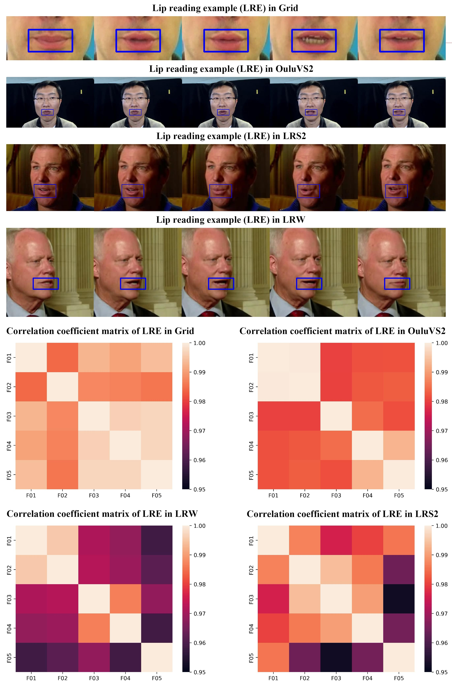

# Brief introduction towards micro lip reading in the wild

Lip reading, the ability to recognize what is being said from visual information alone, is an impressive skill but very challenging task. And it is of essential research value for the application scenarios: improving obvious performances where multiple speakers are present or the acoustic signal is noisy; resolving speech perception problems effectively for persons who have hearing impairment; generating lip-passwords for liveness detection by virtue of its difficulty to copy and high dynamic characteristics; synthesizing a high quality video of a certain person with convincing lip sync from audio.

During the past decades, numerous efforts have already been paid to this field. Nevertheless, most of them are proposed without considering micro lip reading cases which are quite common in our daily lives. Meanwhile, the existing lip reading datasets are generally captured under normal conditions with relative standard lip movements. However, towards some practical application scenarios, micro lip reading in the wild is more preferred, such as last words in hospital, whispers in the wild, speaking with the aged or patients with ALS (Amyotrophic Lateral Sclerosis), etc. In these cases, the effective micro lip reading approach in the wild is essentially required to ensure the performance.

To this end, we first establish a challenging labelled micro-lip reading dataset termed HUST-LMLR. It consists of 400 speech video clip samples captured from the unconstrained movies to reveal the characteristics of “micro lip reading" in the wild. To our knowledge, HUST-LMLR is the first micro lip reading dataset that involves the spatial-temporal sequence information. This pic 

shows some snapshots of the micro-lip reading samples within it. By using the measurement of cosine similarity between two frames within labial area, we can see that the lip movements in some specific situations are much slighter compared with normal speeching. For instance, a weak patient's lip acts in a small range of motion when giving his words. Meanwhile, acoustical signals can hardly be perceived and recognized for supporting. Finally, considering dramatic variations in the wild, such as human pose, illumination, imaging viewpoint and distance, this actually imposes great challenges to accurate micro-lip reading, both for lip localization and lip movements recognition.

# Dataset

As shown in the pic above, micro lip reading suffers from the challenges brought by slight variation of lip movements. Nevertheless, the existing lip reading datasets (e.g., GRID , LRS2-BBC, IBMSR, LRW, LRS3-TED ) can not reveal the "Micro" characteristics well. To address this, we propose to build a new labeled dataset for micro lip reading (termed HUST-LMLR) to shed the light into this research field not well studied before. The essential difference between HUST-LMLR and the existing lip reading datasets is that, lips movements of spoken words performed much slighter than usual due to illness, dying, etc. Meanwhile, to guarantee our dataset with characteristics of "in the wild", video clips from the unconstrained movies were collected instead of from the limited number of volunteers under the indoor scene conditions. After capturing the micro lip reading video clips from the movies, towards each frame the face region, and local labial region will be annotated. This dataset can be download from [BaiDuYun](www.baidu.com)

### Acknowledgment (File resource)

Samples are extracted from the following films: Harry Potter and the Deathly Hallows; The English Patient; The Great Gatsby(2013); Hachi; Saving Private Ryan; Still Alice; Interstellar; Titanic; The Hobbit: The Desolation of Smaug; Good Will Hunting; Braveheart; Me Before You; Breathe; Elysium; The Godfather: Part III; The Godfather; Detachment; Atonement; The Legend of 1900; Gone with the Wind; King Lear; The Bridge of Madison County; Marriage Story; Passengers; Chernobyl; The King's Speech; The Dallas Buyers Club; 1917; Scent of a Woman; The Last Emperor; X-Men Origins: Wolverine; The Secret Life of Walter Mitty; The Matrix; Inception; The Curious Case of Benjamin Button; Life Lessons From 100-Year-Olds; Black Panther; La La Land; Roman Holiday; The Notebook

